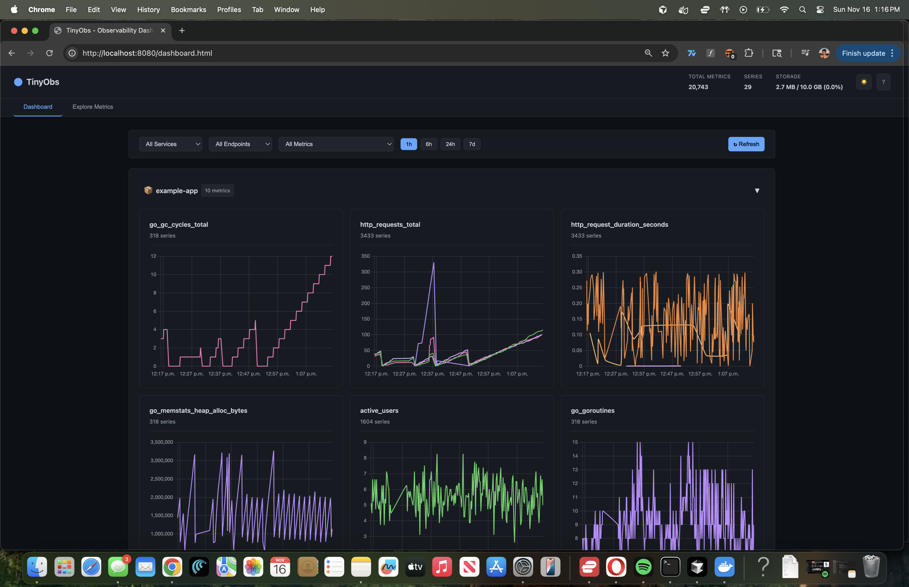
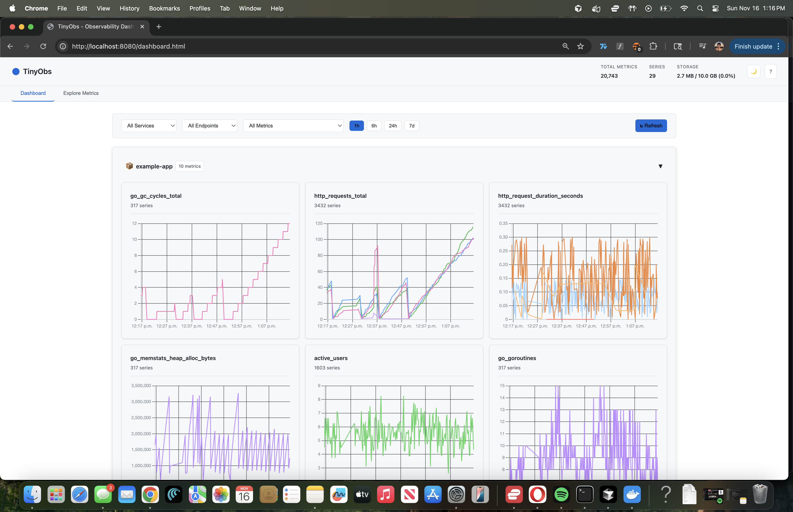
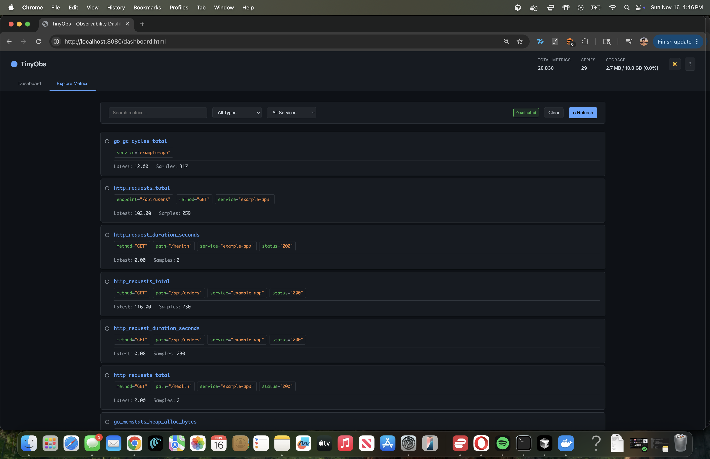
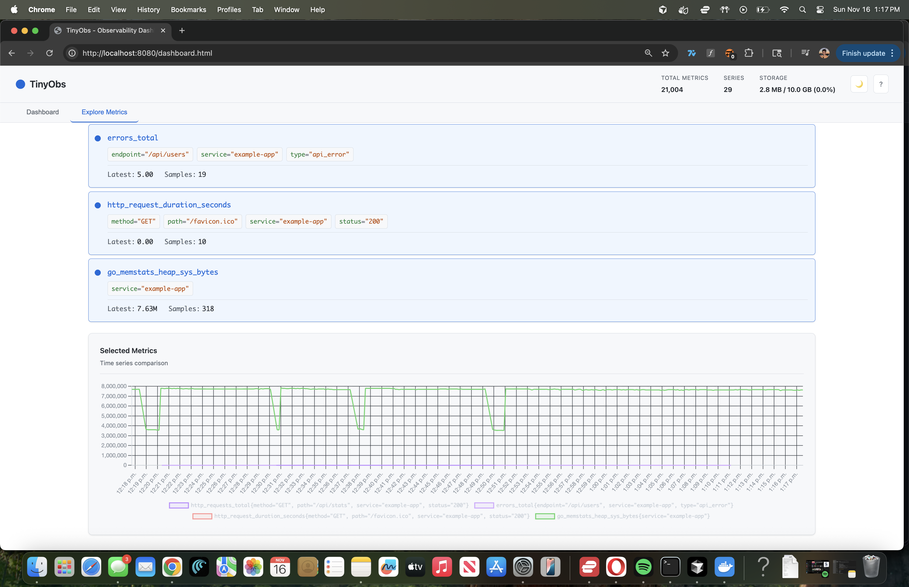

# TinyObs

**A metrics platform you can actually understand.**

[](https://go.dev/)
[](LICENSE)



I built TinyObs because I was tired of treating observability systems like magic boxes. Prometheus has 300k+ lines of code. Datadog is a black box. I wanted something I could read in an afternoon and actually understand.

TinyObs is a complete observability platform in ~2,600 lines of Go. It's small enough to read all the code, but sophisticated enough to actually use for local development. You get metrics collection, time-series storage, downsampling, a polished dashboard, and a clean SDK—all without Docker or vendor lock-in.

**What you get:**
- Metrics SDK (counters, gauges, histograms) that takes 5 minutes to integrate
- Persistent storage with BadgerDB (LSM trees + Snappy compression)
- Automatic downsampling: raw → 5min → 1hr aggregates (240x compression)
- Professional dashboard with light/dark themes and keyboard shortcuts
- Query API with smart auto-downsampling based on time range
- Prometheus-compatible `/metrics` endpoint (works with Grafana)
- Actually readable code with comments explaining *why*, not just *what*

**Why you might want this:**
- You want to understand how Prometheus/Datadog work under the hood
- You need local metrics during development without spinning up containers
- You're building a portfolio and want to show you understand real systems
- You're learning Go and want to see a complete, production-quality codebase

## Quick Start

Get it running in 30 seconds:

```bash
# Clone the repo
git clone https://github.com/nicktill/tinyobs.git
cd tinyobs

# Terminal 1: Start TinyObs server
go run cmd/server/main.go

# Terminal 2: Run the example app (generates fake metrics)
go run cmd/example/main.go

# Terminal 3: Open the dashboard
open http://localhost:8080/dashboard.html
```

You should see charts populating with fake API traffic. The example app simulates a web service with random latencies and occasional errors. Press `T` to toggle between light and dark themes, or `?` to see all keyboard shortcuts.

## Screenshots

### Dashboard View
The main dashboard automatically groups metrics by service and displays time-series charts with auto-downsampling.

<table>
  <tr>
    <td width="50%">
      <b>Dark Theme</b><br/>
      
    </td>
    <td width="50%">
      <b>Light Theme</b><br/>
      
    </td>
  </tr>
</table>

### Explore View
Select and overlay multiple metrics on a single chart for comparison. Search, filter, and compare any combination of time series.

<table>
  <tr>
    <td width="50%">
      <b>Metric Selection</b><br/>
      
    </td>
    <td width="50%">
      <b>Multi-Metric Overlay</b><br/>
      
    </td>
  </tr>
</table>

### Key Features Shown
- 🎨 **Light/Dark Theme Toggle** - Seamless theme switching with localStorage persistence
- 📊 **Time Comparison** - Compare current metrics with 24h ago (dashed lines)
- 🔍 **Smart Filtering** - Filter by service, endpoint, or metric name
- ⌨️ **Keyboard Shortcuts** - Navigate fast with shortcuts (D, E, R, T, /, ESC, 1-4)
- 💾 **Export/Import** - Save and restore dashboard configurations as JSON
- 📈 **Multi-Metric Overlays** - Compare multiple time series on one chart

## Dashboard Features

### Keyboard Shortcuts
The dashboard includes powerful keyboard shortcuts for fast navigation:

| Key | Action |
|-----|--------|
| `D` | Switch to Dashboard view |
| `E` | Switch to Explore view |
| `R` | Refresh current view |
| `T` | Toggle light/dark theme |
| `/` | Focus search (Explore view) |
| `ESC` | Clear selection or unfocus input |
| `1-4` | Quick time range selection (1h, 6h, 24h, 7d) |

### Visual Features
- **Theme Toggle** - Click ☀️/🌙 in the header or press `T` to switch themes. Preference saved automatically.
- **Export/Import Configs** - Use ⬇️ button to export dashboard state (filters, theme, time range) as JSON. Use ⬆️ to restore.
- **Time Comparison** - Click "📊 Compare 24h" to overlay metrics from 24 hours ago (shown as dashed lines) for trend analysis.
- **Auto-Downsampling** - Charts automatically select the best resolution (raw/5m/1h) based on time range for optimal performance.

## Using the SDK

### Installation

```bash
go get github.com/nicktill/tinyobs
```

### Basic Usage

Here's how to add TinyObs to your own Go app:

```go
package main

import (
    "context"
    "net/http"

    "github.com/nicktill/tinyobs/pkg/sdk"
    "github.com/nicktill/tinyobs/pkg/sdk/httpx"
)

func main() {
    // Create a TinyObs client
    client, _ := sdk.New(sdk.ClientConfig{
        Service:  "my-app",
        Endpoint: "http://localhost:8080/v1/ingest",
    })

    client.Start(context.Background())
    defer client.Stop()

    // Wrap your HTTP handlers to get automatic metrics
    mux := http.NewServeMux()
    mux.HandleFunc("/", homeHandler)

    handler := httpx.Middleware(client)(mux)
    http.ListenAndServe(":8080", handler)
}
```

This automatically tracks:
- Request counts by endpoint, method, and status
- Request duration histograms
- Go runtime metrics (memory, goroutines, GC stats)

### Creating Custom Metrics

```go
// Counter - for things that only go up
requests := client.Counter("http_requests_total")
requests.Inc("endpoint", "/api/users", "method", "GET")

// Gauge - for values that go up and down
connections := client.Gauge("active_connections")
connections.Inc()  // connection opened
connections.Dec()  // connection closed

// Histogram - for measuring distributions
duration := client.Histogram("request_duration_seconds")
duration.Observe(0.234, "endpoint", "/api/users")
```

## Architecture

```
┌─────────────────┐    ┌─────────────────┐    ┌──────────────────────────┐
│   Your App      │    │   TinyObs SDK   │    │    Ingest Server         │
│                 │    │                 │    │                          │
│ ┌─────────────┐ │    │ ┌─────────────┐ │    │ ┌──────────────────────┐ │
│ │  Metrics    │─┼────┼─│   Batcher   │─┼────┼─│     REST API         │ │
│ │  Counter    │ │    │ │ (5s flush)  │ │    │ │  /v1/ingest          │ │
│ │  Gauge      │ │    │ └─────────────┘ │    │ │  /v1/query/range     │ │
│ │  Histogram  │ │    │                 │    │ └──────────────────────┘ │
│ └─────────────┘ │    │ ┌─────────────┐ │    │                          │
│                 │    │ │HTTP Transport│─┼────┼─│ ┌──────────────────┐ │
│ ┌─────────────┐ │    │ └─────────────┘ │    │ │  Storage Layer    │ │
│ │ Middleware  │ │    │                 │    │ │  ┌──────────────┐ │ │
│ │Auto-metrics │ │    │ ┌─────────────┐ │    │ │  │ Memory       │ │ │
│ └─────────────┘ │    │ │Runtime Stats│ │    │ │  │ BadgerDB LSM │ │ │
│                 │    │ └─────────────┘ │    │ │  └──────────────┘ │ │
└─────────────────┘    └─────────────────┘    │ └──────────────────┘ │
                                               │                          │
                                               │ ┌──────────────────────┐ │
                                               │ │  Compaction Engine   │ │
                                               │ │  Raw → 5m → 1h       │ │
                                               │ │  (240x reduction)    │ │
                                               │ └──────────────────────┘ │
                                               │                          │
                                               │ ┌──────────────────────┐ │
                                               │ │  Chart.js Dashboard  │ │
                                               │ │  /dashboard.html     │ │
                                               │ └──────────────────────┘ │
                                               └──────────────────────────┘
```

**How it works:**
1. SDK batches metrics and sends every 5s via HTTP
2. Server stores in BadgerDB (LSM tree with Snappy compression)
3. Compaction runs hourly: raw → 5m → 1h aggregates (240x compression)
4. Dashboard queries with auto-downsampling for performance
5. Time-series charts update every 30s

## API

TinyObs provides a REST API for ingesting and querying metrics:

### POST /v1/ingest
Ingest metrics from your application.

```json
{
  "metrics": [
    {
      "name": "http_requests_total",
      "type": "counter",
      "value": 42,
      "timestamp": "2025-11-16T01:30:00Z",
      "labels": {
        "service": "api-server",
        "endpoint": "/users",
        "status": "200"
      }
    }
  ]
}
```

### GET /v1/query
Query metrics with optional filtering.

```bash
curl "http://localhost:8080/v1/query?metric=cpu_usage&start=2025-11-16T00:00:00Z"
```

### GET /v1/query/range
Query metrics with time-range and auto-downsampling.

```bash
curl "http://localhost:8080/v1/query/range?metric=cpu_usage&start=2025-11-16T00:00:00Z&end=2025-11-16T23:59:59Z&maxPoints=1000"
```

**Parameters:**
- `metric` (required): Metric name to query
- `start` (optional): Start time (RFC3339 or 2006-01-02T15:04:05)
- `end` (optional): End time (RFC3339 or 2006-01-02T15:04:05)
- `maxPoints` (optional): Maximum data points to return (default: 1000, max: 5000)

Returns downsampled time-series data with automatic resolution selection (raw/5m/1h).

### GET /v1/metrics/list
List all available metric names from the last 24 hours.

```bash
curl "http://localhost:8080/v1/metrics/list"
```

### GET /v1/stats
Get storage statistics.

```bash
curl "http://localhost:8080/v1/stats"
```

Returns total metrics count, unique series count, storage size, and time range.

## Project Structure

```
tinyobs/
├── cmd/
│   ├── server/              # Ingest server (main.go + tests)
│   └── example/             # Example app that generates metrics
├── pkg/
│   ├── sdk/                 # Client SDK for instrumenting apps
│   │   ├── client.go        # Main SDK client
│   │   ├── batch/           # Batching logic (5s flush)
│   │   ├── metrics/         # Counter, Gauge, Histogram types
│   │   ├── httpx/           # HTTP middleware for auto-metrics
│   │   ├── runtime/         # Runtime metrics collector (Go stats)
│   │   └── transport/       # HTTP transport layer
│   ├── ingest/              # Server-side ingestion
│   │   ├── handler.go       # REST API handlers
│   │   └── dashboard.go     # Dashboard API endpoints
│   ├── storage/             # Pluggable storage layer
│   │   ├── interface.go     # Storage abstraction
│   │   ├── memory/          # In-memory storage (fast, ephemeral)
│   │   └── badger/          # BadgerDB storage (persistent, LSM)
│   └── compaction/          # Multi-resolution downsampling
│       ├── compactor.go     # Compaction engine
│       └── types.go         # Aggregate types and metadata
└── web/
    ├── index.html           # Simple dashboard (legacy)
    └── dashboard.html       # Chart.js time-series dashboard
```

**Code stats:** ~2,600 lines of production Go code (excluding tests)

## The 53-Day Bug

Early in development, I forgot to kill the server. I left it running on my laptop for 53 days.

When I finally noticed, TinyObs had collected 2.9 million metrics and was eating 4.5 GB of RAM. The example app had been dutifully sending fake API metrics every 2 seconds, through sleep cycles, OS updates, and countless lid closes. macOS just... kept it alive.

**Lessons learned the hard way:**
- In-memory storage without retention = your RAM becomes a black hole
- Memory leaks are silent killers. Things just get slower until you notice
- Even side projects need production patterns (retention policies, cardinality limits)
- macOS is *really* good at keeping background processes alive

This bug shaped the entire V2.0 roadmap. I added BadgerDB for persistent storage, retention policies, cardinality protection, and downsampling. The 53-day bug forced me to build a real system instead of a toy.

## What's Missing (And Why)

TinyObs is opinionated. I left stuff out on purpose to keep the codebase learnable.

**No query language yet:** You query one metric at a time. No `rate()` or `sum()` functions. PromQL-like queries are planned for V4.0, but honestly, I'm still figuring out the best way to implement them without making the code explode.

**No alerting:** You can see your metrics, but it won't email you when things break. V3.0 will add basic threshold alerts, but for now you're on your own.

**No live updates:** Dashboard refreshes every 30 seconds via polling. WebSockets would be cooler, but polling is way simpler to implement and understand. (Also on the V3.0 list.)

**Runs locally only:** No authentication, no HTTPS, no clustering. This is a local dev tool, not a production SaaS. If you want to run this in production, you'll need to add auth yourself.

**Path assumptions:** The server expects `./web/` and `./data/` to exist relative to where you run it. This is lazy, I know. Just run it from the project directory.


## Roadmap

### ✅ V2.0 - Completed
- [x] Time-series charts with Chart.js
- [x] BadgerDB integration (LSM-based storage with Snappy compression)
- [x] Query API with time-range filtering (`/v1/query/range`)
- [x] Downsampling (raw → 5m → 1h aggregates, 240x compression)
- [x] Production-quality dashboard with auto-downsampling

### ✅ V2.1 - Polish (Completed)
- [x] Resolution-aware data retention (enable cleanup)
- [x] Cardinality protection (prevent label explosion)
- [x] Prometheus `/metrics` endpoint (Grafana compatibility)
- [x] Enhanced .gitignore for build artifacts

### ✅ V2.2 - Smart Dashboard (Complete!)
- [x] Multi-metric overlay charts (compare metrics on same chart)
- [x] Dashboard templates (Go Runtime, HTTP API, Database presets)
- [x] Label-based filtering UI with auto-discovery
- [x] Modern gradient UI with improved UX
- [x] Light/dark theme toggle with localStorage persistence
- [x] Enhanced keyboard shortcuts (D, E, R, T, /, ESC, 1-4)
- [x] Stable color assignment (no more flickering charts!)
- [x] Auto-scroll to selected metrics in Explore view
- [x] Export/import dashboard configurations (JSON)
- [x] Time comparison view (compare to 24h ago)

### 📅 V3.0 - Real-time & Anomaly Detection (Next 2-4 weeks)
- [ ] WebSocket live updates (replace 30s polling)
- [ ] Statistical anomaly detection (2σ from moving average)
- [ ] Visual anomaly indicators on charts (red zones)
- [ ] Simple threshold alerts (email/webhook)
- [ ] Alert history view

### 🎯 V4.0 - Query Language & Advanced Features (2-3 months)
- [ ] Simple PromQL-like query language
- [ ] Functions: `avg()`, `sum()`, `rate()`, `count()`
- [ ] Label matching: `{service="api"}`
- [ ] Time ranges: `[5m]`, `[1h]`
- [ ] Query builder UI in dashboard
- [ ] Performance benchmarks

### 🚀 V5.0+ - Production & Scale (4-6+ months)
- [ ] High availability and clustering
- [ ] Cloud storage backends (S3, GCS, MinIO)
- [ ] Authentication & API keys
- [ ] Multi-tenancy support
- [ ] Distributed tracing support (OpenTelemetry)
- [ ] Service topology visualization

## Why I Built This

I've used Prometheus, Datadog, and New Relic professionally. They're great tools, but they're also black boxes. When something breaks or behaves weirdly, you're stuck Googling instead of actually understanding what's happening.

**The learning problem:**
- Prometheus: 300k+ lines of C++ and Go with gnarly TSDB internals
- Datadog/New Relic: Closed source, can't even look
- VictoriaMetrics: Production-focused, optimized to hell, hard to follow

I wanted something I could actually *understand*. So I built TinyObs with three rules:

1. **Small enough to read**: ~2,600 lines of Go (excluding tests). You can read it all in one sitting.
2. **Real enough to use**: Not a toy. Persistent storage, compression, downsampling, professional UI.
3. **Honest documentation**: Comments explain *why* decisions were made, not just what the code does.

This is what I wish existed when I was learning systems programming. If you're trying to understand how observability works, or you want a meaty portfolio project that shows real engineering thinking, this is for you.

## Development

```bash
# Run from source
go run cmd/server/main.go

# Run tests
make test
go test ./... -v

# Build binaries
make build
```

## Contributing

I built this to learn, and I'd love for others to learn from it too. Contributions are welcome, especially from people who are new to Go or systems programming.

**If you're a beginner:**
- Look for issues labeled `good first issue` - these are specifically designed to be approachable
- Don't worry about making mistakes. I'll help you through the PR process
- Ask questions in issues. There are no dumb questions

**If you're experienced:**
- Look for `help wanted` issues where I could use design input
- Feel free to suggest architectural improvements, but keep in mind the goal is readability over optimization
- Documentation improvements are always appreciated

**General guidelines:**
- Write tests for new features
- Add comments explaining *why*, not just *what*
- Keep the codebase small - if a feature adds >500 lines, let's discuss first
- Run `go test ./...` before submitting

Fork it, break it, fix it, submit a PR. I'll do my best to review quickly and help you get it merged.

## Resources

- [Prometheus TSDB Design](https://github.com/prometheus/prometheus/blob/main/tsdb/docs/format/README.md) - Time-series internals
- [Gorilla Paper](http://www.vldb.org/pvldb/vol8/p1816-teller.pdf) - Compression algorithm
- [Systems Performance](http://www.brendangregg.com/systems-performance-2nd-edition-book.html) - Observability fundamentals

## License

MIT - see [LICENSE](LICENSE)

---

Built by [@nicktill](https://github.com/nicktill)
