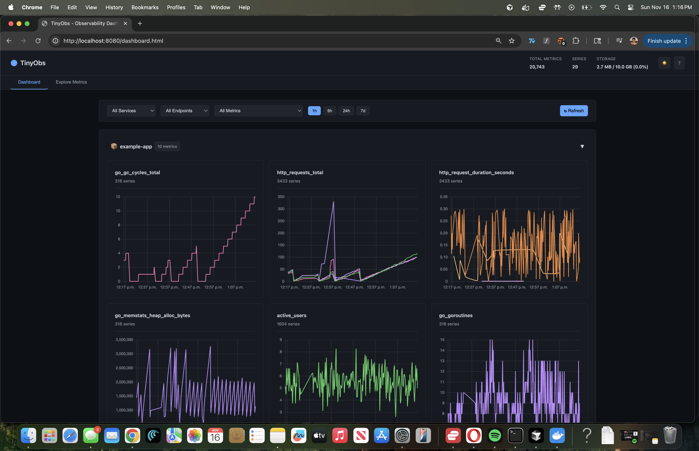

# TinyObs

**A lightweight metrics platform you can actually understand.**

[](https://go.dev/)
[](LICENSE)



TinyObs is a metrics platform in about 6,000 lines of Go (excluding tests and comments). Small enough to read in a weekend, useful enough for local development.

## Quick Start

### Option 1: Docker

```bash
# Start server only
make docker-up

# Or start server + example app (generates demo metrics)
make docker-demo

# View dashboard
open http://localhost:8080
```

**Alternative (without Make):**
```bash
docker-compose up -d                    # Server only
docker-compose --profile example up -d  # Server + example app
```

### Option 2: Local Development

```bash
# Terminal 1: Start server
go run ./cmd/server

# Terminal 2: Run example app (generates metrics)
go run ./cmd/example

# Terminal 3: Open dashboard
open http://localhost:8080
```

## What You Get

- **Works with what you already have**: scrapes Prometheus `/metrics` endpoints and receives OpenTelemetry (OTLP/HTTP)
- **Persistent storage** on BadgerDB: ~14 bytes/sample, crash-safe, 72h retention by default
- **PromQL**, checked against Prometheus's own test suite ([what's supported](#promql-support))
- **Prometheus HTTP API**, so Grafana can use TinyObs as a Prometheus data source
- **Dashboard** for exploring your metrics
- A small **Go SDK** for apps with no instrumentation yet

## Getting data in

**Scrape a Prometheus endpoint.** Anything instrumented with a Prometheus client library works:

```bash
TINYOBS_SCRAPE=api=localhost:2112,worker=localhost:9100 go run ./cmd/server
```

Each entry is `[job=]host:port[/path]` (the path defaults to `/metrics`). TinyObs records `up` and
`scrape_duration_seconds` per target, marks series stale when they disappear, and lists targets at
`/api/v1/targets`.

**Send OpenTelemetry metrics.** Point any OTLP/HTTP exporter at TinyObs:

```bash
OTEL_EXPORTER_OTLP_METRICS_ENDPOINT=http://localhost:8080/v1/metrics \
OTEL_EXPORTER_OTLP_METRICS_PROTOCOL=http/protobuf ./your-app
```

Metrics are named the way Prometheus names OTLP metrics: `http.server.request.duration` (unit `s`) becomes
`http_server_request_duration_seconds`, `service.name` becomes `job` and `service.instance.id` becomes `instance`.
Only cumulative temporality is accepted; delta data points are rejected with an explicit message (set the
exporter's temporality preference to cumulative, which is the default for most SDKs).

## Using the SDK

```go
package main

import (
    "context"
    "net/http"
    "time"
    "github.com/nicktill/tinyobs/pkg/sdk"
    "github.com/nicktill/tinyobs/pkg/sdk/httpx"
)

func main() {
    // Initialize TinyObs client
    client, _ := sdk.New(sdk.ClientConfig{
        Service:  "my-app",                // becomes the job label
        Endpoint: "http://localhost:8080", // TinyObs, or any OTLP/HTTP endpoint
    })
    
    ctx := context.Background()
    client.Start(ctx)
    defer client.Stop()
    
    // Create HTTP server
    mux := http.NewServeMux()
    mux.HandleFunc("/api/users", func(w http.ResponseWriter, r *http.Request) {
        w.Write([]byte("OK"))
    })
    
    // Add TinyObs middleware - automatically tracks:
    //   - http_requests_total (counter): by method, path, status
    //   - http_request_duration_seconds (histogram): request latency
    handler := httpx.Middleware(client)(mux)

    // You can also create custom metrics for business logic:
    activeUsers := client.Gauge("active_users")
    activeUsers.Set(42.0) // Set current active users

    errors := client.Counter("errors_total")
    errors.Inc("type", "api_error", "endpoint", "/api/users")

    // Your app listens on its own port; TinyObs uses 8080.
    http.ListenAndServe(":3000", handler)
}
```

## API

TinyObs serves the [Prometheus HTTP API](https://prometheus.io/docs/prometheus/latest/querying/api/):
point Grafana's Prometheus data source at `http://localhost:8080`.

| Endpoint | Purpose |
|---|---|
| `GET/POST /api/v1/query`, `/api/v1/query_range` | PromQL queries |
| `GET/POST /api/v1/series`, `/api/v1/labels`, `GET /api/v1/label/<name>/values` | Series and label discovery |
| `GET /api/v1/metadata` | Metric type and help text |
| `GET /api/v1/status/tsdb`, `/api/v1/status/buildinfo` | Cardinality statistics, version |
| `GET /-/healthy`, `/-/ready` | Health checks |
| `POST /v1/metrics` | OTLP/HTTP metrics (protobuf or JSON, optionally gzipped) |
| `GET /api/v1/targets` | Scrape target health |

```bash
curl -s localhost:8080/api/v1/query --data-urlencode 'query=sum by (path) (rate(http_requests_total[5m]))'
```

### PromQL support

The engine is tested against [Prometheus's PromQL test suite](https://github.com/prometheus/prometheus/tree/v3.7.0/promql/promqltest/testdata)
(`make promql-compat`). Every supported feature returns Prometheus's result; everything else is an explicit
"not supported by TinyObs" error, never a guess.

- **Supported:** selectors with `=` `!=` `=~` `!~`, range vectors, `offset`, subqueries; arithmetic, comparison
  (with `bool`) and set operators with `on`/`ignoring`/`group_left`/`group_right`; `sum avg min max count group
  stddev stdvar topk bottomk quantile`; `rate irate increase delta idelta deriv predict_linear resets changes`,
  `*_over_time`, `histogram_quantile` (classic histograms), math, clamping, date and label functions.
- **Not supported:** native histograms, the `@` modifier, duration expressions, `count_values`, `limitk`,
  `holt_winters`, `sort_by_label`.

## Configuration

Environment variables:

| Variable | Description | Default |
|----------|-------------|---------|
| `PORT` | Server port | `8080` |
| `TINYOBS_DATA_DIR` | Data directory | `./data/tinyobs-v2` |
| `TINYOBS_RETENTION` | How long samples are kept | `72h` |
| `TINYOBS_MAX_SERIES` | Series limit; protects against label explosions | `50000` |
| `TINYOBS_MAX_MEMORY_MB` | BadgerDB memory budget | `64` |
| `TINYOBS_SCRAPE` | Comma-separated scrape targets, `[job=]host:port[/path]` | none |
| `TINYOBS_SCRAPE_INTERVAL` | Scrape interval | `15s` |

Disk use is bounded by `max series × samples per series in the retention window × ~14 bytes`.

## Project Structure

```
tinyobs/
├── cmd/
│   ├── server/     # Main server
│   └── example/    # Example app
├── pkg/
│   ├── api/        # Prometheus HTTP API
│   ├── labels/     # Series labels and matchers
│   ├── otlp/       # OTLP/HTTP receiver
│   ├── promql/     # Query engine
│   ├── scrape/     # Prometheus scraping
│   ├── sdk/        # Go client SDK (exports OTLP)
│   ├── server/     # HTTP server wiring
│   └── tsdb/       # Time series storage
└── web/            # Dashboard UI
```

## Why TinyObs?

I built this to understand how metrics systems work. Prometheus has 300k+ lines. TinyObs is about 6,000 lines you can actually read and learn from.

**Perfect for:**
- Learning how metrics systems work
- Local development metrics
- Understanding Go systems programming

**Not for:**
- Production deployments (use Prometheus)
- Distributed tracing (use Jaeger/Zipkin)
- Large-scale deployments

## Documentation

- [Quick Start Guide](QUICK_START.md) - Detailed setup and testing
- [V2 design](docs/design/v2.md) - Architecture and the decisions behind it
- [ADRs](docs/adr/) - Storage layout, timestamp resolution

## Development

### Local Development

```bash
# Run tests (and the Prometheus conformance suite)
make test
make promql-compat

# Build
go build ./cmd/server

# Run with custom config
PORT=3000 TINYOBS_RETENTION=168h go run ./cmd/server
```

### Docker

**Recommended (using Make):**
```bash
make docker-up      # Start server only
make docker-demo    # Start server + example app
make docker-down    # Stop all services
make docker-logs    # View logs
```

**Alternative (direct docker-compose):**
```bash
docker-compose up -d --build                    # Server only
docker-compose --profile example up -d --build  # Server + example app
docker-compose --profile example down           # Stop all services
docker-compose logs -f                          # View logs
```

See [QUICK_START.md](QUICK_START.md) for detailed instructions.

## License

MIT - see [LICENSE](LICENSE)

---

Built by [@nicktill](https://github.com/nicktill)
