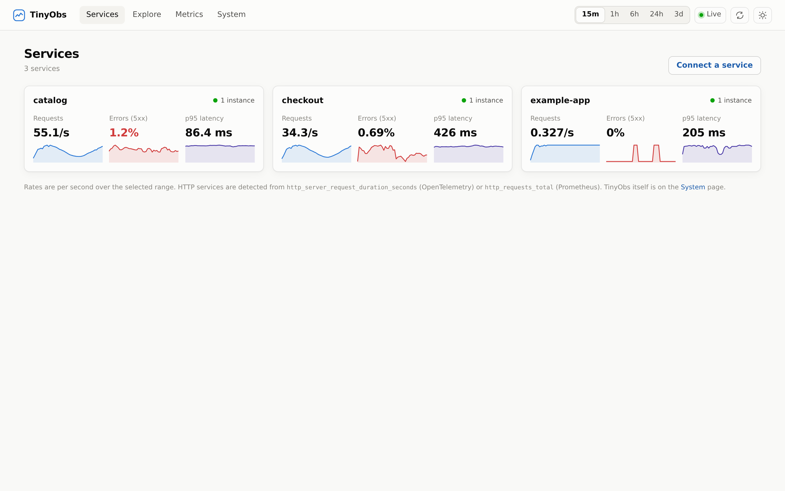
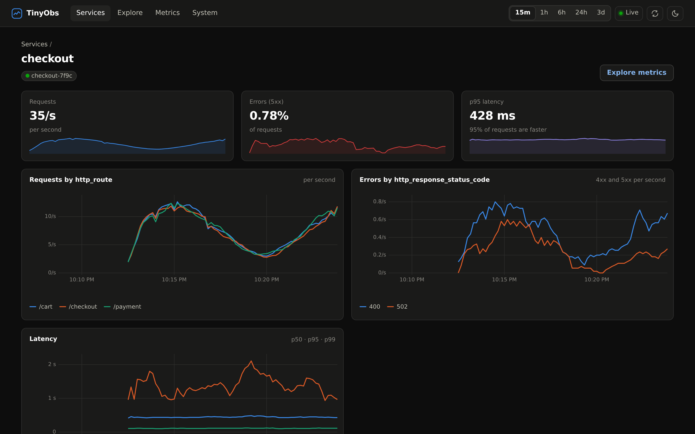
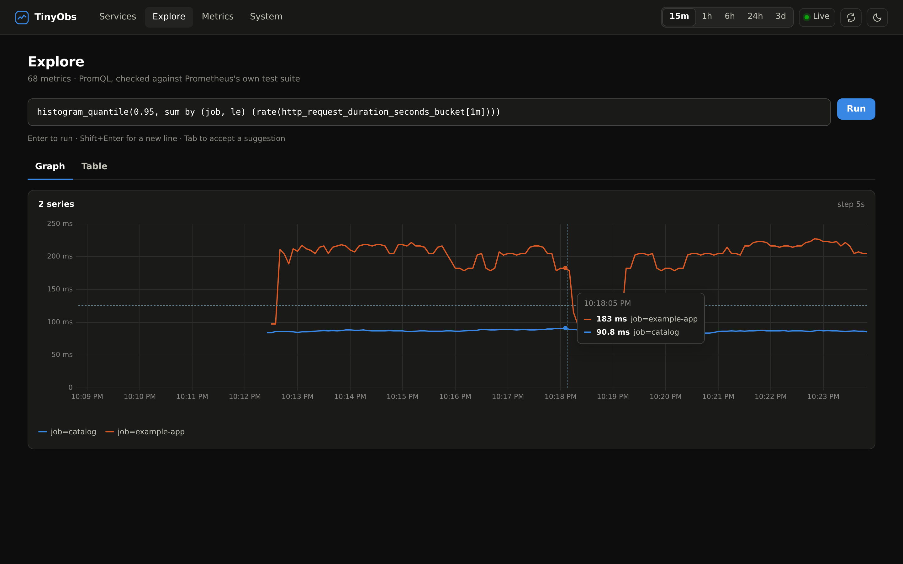
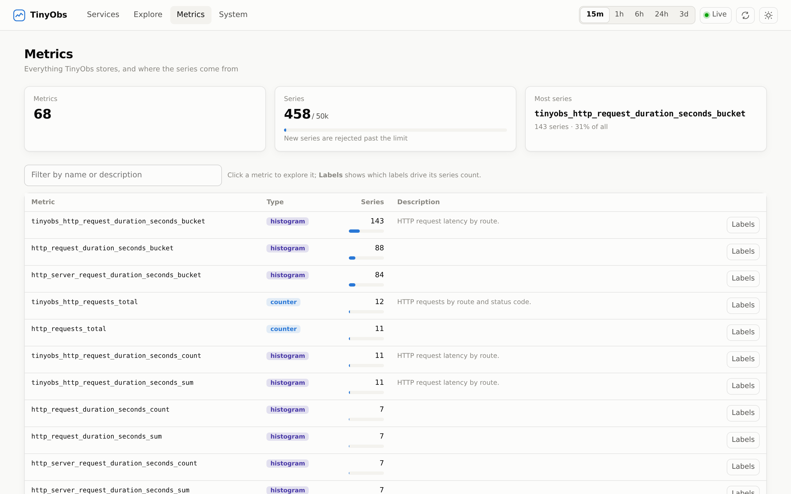
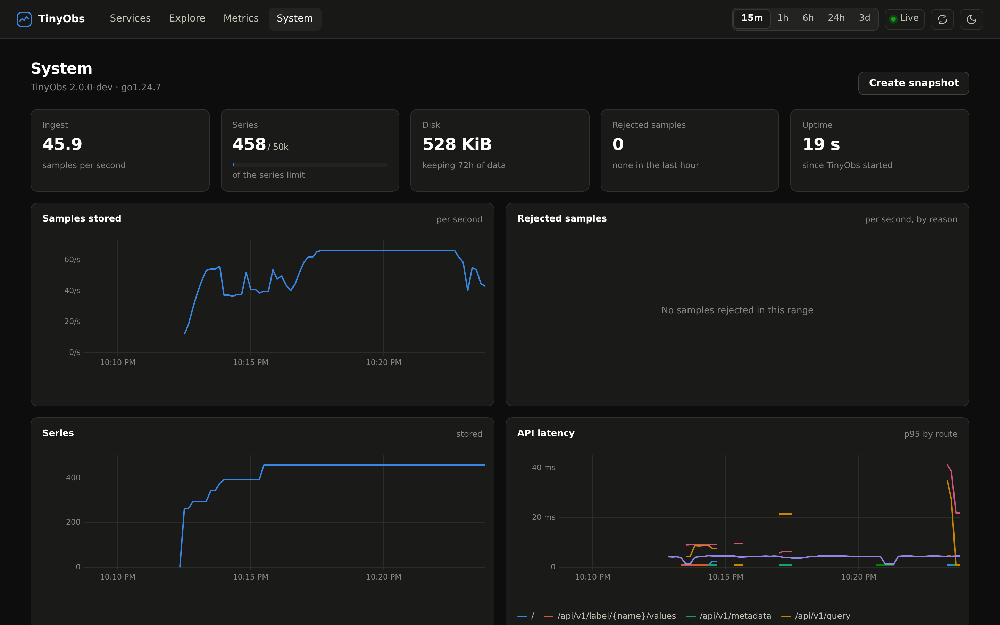

# TinyObs

**Production-style metrics for your app, without running an observability stack.**

One binary. Point it at your service, open a browser, and see request rate, errors and latency. TinyObs speaks
the standards your code already uses (Prometheus scraping and OpenTelemetry), stores metrics on local disk,
and answers PromQL checked against Prometheus's own test suite.

[](https://github.com/nicktill/tinyobs/actions/workflows/ci.yml)
[](https://go.dev/)
[](LICENSE)

<picture>
  <source media="(prefers-color-scheme: dark)" srcset="docs/screenshots/services-dark.png">
  
</picture>

```bash
go install github.com/nicktill/tinyobs/cmd/tinyobs@latest
tinyobs -scrape api=localhost:2112     # or just `tinyobs` and send it OpenTelemetry
open http://localhost:8421
```

## Why TinyObs

- **Useful in the first minute.** Services that serve HTTP get request, error and latency panels automatically.
  You don't write queries or build dashboards first.
- **Nothing proprietary.** Scrape any Prometheus `/metrics` endpoint, or send OTLP from any OpenTelemetry SDK or
  Collector. TinyObs listens on the standard OTLP port, 4318, so SDKs with default settings just work.
- **Answers you can trust.** The PromQL engine runs Prometheus's own test suite in CI. Supported features match
  Prometheus: 887 test cases, 0 differences. Anything else is refused with an explicit error; TinyObs never
  guesses.
- **Small.** A 14 MB binary that starts in about 40 ms and idles at 16 MB of memory, with about 7,000 lines of Go
  you can read in a weekend.

## Getting data in

**Scrape Prometheus endpoints.** Anything instrumented with a Prometheus client library works as is:

```bash
tinyobs -scrape api=localhost:2112 -scrape worker=localhost:9100/metrics
```

Each target is `[job=]host:port[/path]`. TinyObs records `up` and `scrape_duration_seconds` for every target,
marks series stale when they disappear, and shows target health on the System page.

**Send OpenTelemetry metrics.** OTLP/HTTP, protobuf or JSON, on port 4318 (and on `/v1/metrics` of the main port):

```bash
OTEL_SERVICE_NAME=checkout \
OTEL_EXPORTER_OTLP_METRICS_ENDPOINT=http://localhost:4318/v1/metrics \
  ./your-app
```

Metrics are named as Prometheus names OTLP metrics: `http.server.request.duration` (unit `s`) becomes
`http_server_request_duration_seconds`, `service.name` becomes `job`, and `service.instance.id` becomes `instance`.
TinyObs stores cumulative temporality, the default of most SDKs. Delta data points and exponential histograms are
rejected with an explicit message rather than approximated.

**No instrumentation yet?** The Go SDK adds request metrics with one middleware and exports them over OTLP:

```go
client, _ := sdk.New(sdk.ClientConfig{Service: "checkout"})
client.Start(ctx)
defer client.Stop()

http.ListenAndServe(":3000", httpx.Middleware(client)(mux)) // http_requests_total, http_request_duration_seconds
client.Counter("orders_total").Inc("region", "eu")
```

## What you get

| | |
|---|---|
| **Services**: RED metrics per service, detected from OpenTelemetry or Prometheus HTTP conventions. | **Service detail**: requests by route, errors by status code, p50/p95/p99 latency, a routes table and runtime metrics. |
|  |  |
| **Explore**: PromQL with autocomplete, graph and table views, and hints such as "this is a counter, use `rate()`". | **Metrics and System**: the catalog with series counts per label, and TinyObs's own health and scrape targets. |
|  |  |

Charts use a color-blind-safe palette validated in light and dark mode, and every chart has a legend and a
tooltip showing all series at the cursor.

**Grafana works too.** TinyObs serves the Prometheus HTTP API (`query`, `query_range`, `series`, `labels`,
`label/<name>/values`, `metadata`), so you can add it as a Prometheus data source at `http://localhost:8421`.

## PromQL support

`make promql-compat` runs Prometheus v3.7.0's PromQL test files against TinyObs. CI runs them on every change.

| | Test cases |
|---|---|
| Match Prometheus exactly | 887 |
| Refused with "not supported by TinyObs" | 370 |
| Skipped: need native histograms, which TinyObs doesn't store | 241 |
| **Different from Prometheus** | **0** |

**Supported:**
- selectors with `=` `!=` `=~` `!~`, `offset` and subqueries;
- arithmetic, comparison (with `bool`) and set operators, with `on`/`ignoring`/`group_left`/`group_right`;
- `sum avg min max count group stddev stdvar topk bottomk quantile`;
- `rate irate increase delta idelta deriv predict_linear resets changes`, all `*_over_time` functions and
  `histogram_quantile`;
- math, clamping, date and label functions.

**Not supported:**
- native histograms;
- the `@` modifier and duration expressions;
- `count_values`, `limitk`, `holt_winters` and `sort_by_label`.

## Running it for real

TinyObs is one process on one machine. It suits local development, CI, demos and small deployments where
losing monitoring while that machine is down is acceptable. For those:

```bash
tinyobs -listen :8421 -auth-token "$TOKEN" -tls-cert cert.pem -tls-key key.pem -retention 168h
```

- **Authentication.** `-auth-token` protects every endpoint except `/-/healthy` and `/-/ready`. Send it as
  `Authorization: Bearer …` or as the password of HTTP Basic auth, so browsers prompt for it and Grafana,
  Prometheus and OTLP exporters all support it.
- **Bounded resources.**
  - Retention (default 72h) and the series cap (`-max-series`, default 50,000) bound disk and memory.
  - New series past the cap are rejected and counted, so a label explosion can't take the process down.
  - Queries are limited to 5M samples, 11,000 points per series and 30 s.
- **Backups.** `POST /api/v1/admin/tsdb/snapshot` writes a consistent snapshot while TinyObs runs;
  `tinyobs restore FILE -data DIR` restores it.
- **Monitoring TinyObs.** It records its own ingest rate, rejections, series count, disk use and API latency (see
  the System page), and exposes them at `/metrics`.
- **Docker.** `docker compose up` runs it as a non-root user with data on a volume.
  `docker compose --profile example up` adds an instrumented demo app.

There is no replication or high availability. It's not the right tool for long-term storage, many teams, or
high-cardinality production fleets; use Prometheus, Mimir or VictoriaMetrics for those.

## Configuration

Every flag can also be set through an environment variable, which is handy in containers.

| Flag | Environment | Default | |
|---|---|---|---|
| `-listen` | `TINYOBS_LISTEN` | `127.0.0.1:8421` | UI and API address |
| `-otlp-listen` | `TINYOBS_OTLP_LISTEN` | `127.0.0.1:4318` | Extra OTLP listener; empty disables it |
| `-data` | `TINYOBS_DATA_DIR` | `~/.tinyobs` | Data directory |
| `-retention` | `TINYOBS_RETENTION` | `72h` | How long samples are kept |
| `-max-series` | `TINYOBS_MAX_SERIES` | `50000` | Series limit |
| `-scrape` | `TINYOBS_SCRAPE` | | Targets, `[job=]host:port[/path]`, repeatable or comma-separated |
| `-scrape-interval` | `TINYOBS_SCRAPE_INTERVAL` | `15s` | Scrape interval |
| `-auth-token` | `TINYOBS_AUTH_TOKEN` | | Require this token |
| `-tls-cert`, `-tls-key` | `TINYOBS_TLS_CERT`, `TINYOBS_TLS_KEY` | | Serve HTTPS |
| `-memory-mb` | `TINYOBS_MAX_MEMORY_MB` | `64` | Storage cache budget |
| `-open` | | | Open the UI in a browser after starting |

TinyObs listens on localhost by default and warns when it listens on a wider address without a token.

## Performance

Measured on a 4-core Linux VM. Each figure comes with the command that reproduces it.

| | |
|---|---|
| Binary | 14 MB, including the UI (`make build`) |
| Startup | 36 ms empty, 120 ms with 10,000 series and 14M samples |
| Memory | 16 MB idle, 47 MB with 10,000 series |
| Disk | ~13.6 bytes/sample on a deliberately hard mix of counters, gauges and random floats; regular data compresses further ([ADR 0001](docs/adr/0001-storage-layout.md)) |
| Ingest | ~240,000 samples/s (`go test -bench Ingest ./pkg/tsdb`) |
| Query | `sum by (instance) (rate(x[5m]))` over 1,000 series for 1h at a 15s step: ~125 ms (`go test -bench RangeQuery ./pkg/promql`) |

## How it works

TinyObs is small on purpose, and meant to be read. The whole server is about 7,000 lines of Go:

| Package | Lines | What it does |
|---|---|---|
| [`pkg/tsdb`](pkg/tsdb) | 840 | Storage: one key per sample in BadgerDB with ZSTD, an in-memory label index, retention, crash-safe commits |
| [`pkg/promql`](pkg/promql) | 2,640 | Lexer, parser, type checker and step-based evaluator, checked against Prometheus's tests |
| [`pkg/api`](pkg/api) | 530 | The Prometheus HTTP API |
| [`pkg/scrape`](pkg/scrape) | 520 | Prometheus and OpenMetrics text parsing, scraping, staleness |
| [`pkg/otlp`](pkg/otlp) | 1,170 | OTLP/HTTP decoding (protobuf and JSON) and translation to Prometheus names |
| [`pkg/labels`](pkg/labels) | 310 | Series identity, matchers, validation |
| [`pkg/server`](pkg/server) | 460 | Wiring, auth, snapshots, self-monitoring |
| [`web`](web) | 1,700 | The UI: vanilla JavaScript modules, no build step, embedded in the binary |

The [V2 design document](docs/design/v2.md) explains each decision: why storage keeps one key per sample
rather than compressed chunks ([measured in ADR 0001](docs/adr/0001-storage-layout.md)), how the engine
evaluates, and what TinyObs deliberately doesn't do.

**Not planned:** traces, logs, alerting, recording rules, clustering, multi-tenancy, a dashboard builder or
long-term storage. Staying small is the feature.

## Development

```bash
make run            # TinyObs on http://localhost:8421
make example        # an instrumented demo app that sends it traffic
make test           # tests with the race detector
make promql-compat  # Prometheus's PromQL test suite against the engine
make build          # bin/tinyobs
```

## License

MIT
