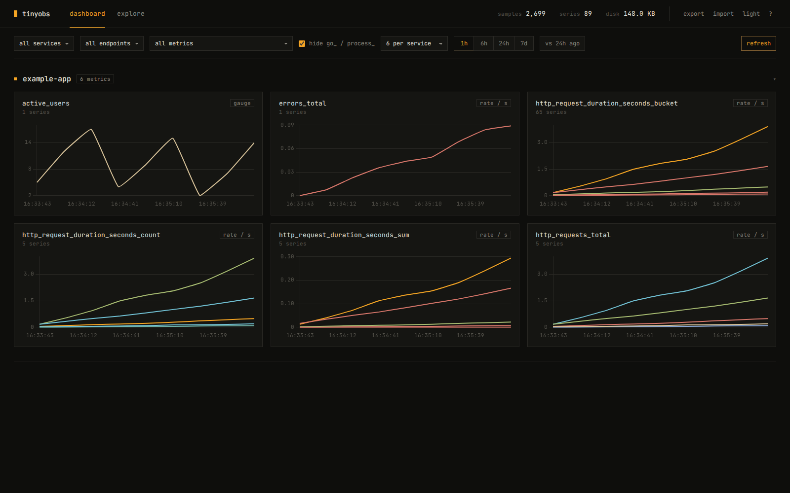
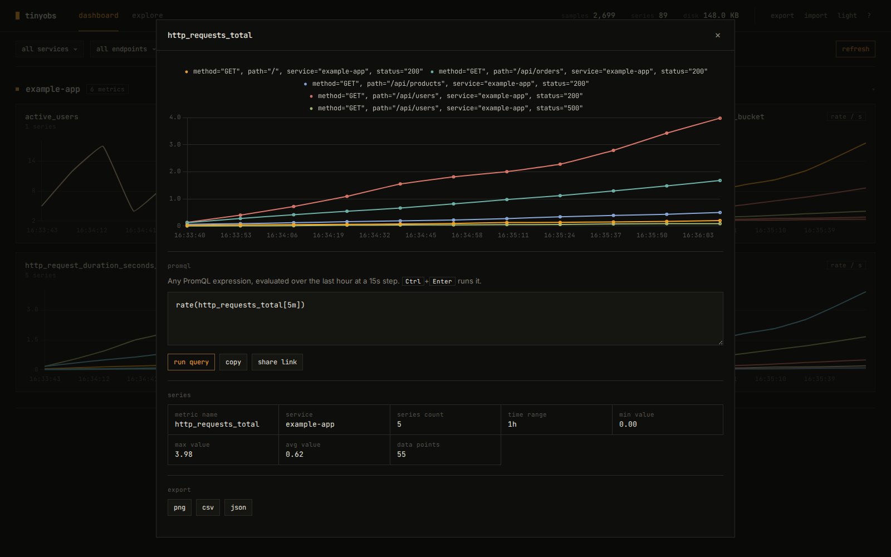

# TinyObs

**A Prometheus-compatible metrics server you can read end to end.**

[Website](https://nicktill.com/tinyobs/) · [Docs](https://nicktill.com/tinyobs/docs/) · [Design notes](docs/design/v2.md)

[](https://github.com/nicktill/tinyobs/actions/workflows/ci.yml)
[](https://go.dev/)
[](LICENSE)



TinyObs is one Go binary with an embedded store. It speaks PromQL (verified against Prometheus's own
test suite), serves the Prometheus HTTP API so Grafana works unchanged, accepts remote write, and
enforces real cardinality and retention limits. The whole thing is about 6,500 lines of Go.

## Quick start

```bash
git clone https://github.com/nicktill/tinyobs && cd tinyobs

make docker-demo            # server + example app generating traffic
# or, without Docker:
go run ./cmd/server         # terminal 1
go run ./cmd/example        # terminal 2

open http://localhost:8080  # dashboard
```

## What's inside

| Package | Lines | What it does |
|---|---:|---|
| `pkg/promql` | 2,820 | Lexer, parser and evaluator, checked against upstream `promqltest` |
| `pkg/sdk` | 1,266 | Go client: counters, gauges, histograms, HTTP middleware |
| `pkg/tsdb` | 920 | BadgerDB storage, label index, retention, cardinality limits |
| `pkg/api` | 725 | Prometheus HTTP API and remote write |
| `pkg/server` | 484 | Wiring, background retention, `/metrics` self-monitoring |
| `pkg/labels` | 345 | Label sets, matchers, validation |

Lines of Go excluding tests, comments and blank lines. `web/` holds the dashboard, `site/` the website.

## Getting metrics in

**Go SDK.** Instruments update memory; the client reports every series once per flush interval.

```go
client, _ := sdk.New(sdk.ClientConfig{
    Service:  "my-app",
    Endpoint: "http://localhost:8080/v1/ingest",
})
client.Start(ctx)
defer client.Stop()

mux := http.NewServeMux()
mux.HandleFunc("GET /users/{id}", getUser)
handler := httpx.Middleware(client)(mux) // http_requests_total, http_request_duration_seconds

client.Counter("errors_total").Inc("type", "api_error")
client.Gauge("queue_depth").Set(42)
client.Histogram("job_seconds").Observe(1.7)
```

The middleware labels requests by the matched route pattern (`/users/{id}`) and collapses 404s into
one value, so IDs in URLs and scanners can't create new series.

**Remote write.** Prometheus, Grafana Alloy, the OpenTelemetry Collector and vmagent can push directly:

```yaml
remote_write:
  - url: http://localhost:8080/api/v1/write
```

## Querying

TinyObs serves the [Prometheus HTTP API](https://prometheus.io/docs/prometheus/latest/querying/api/).
Add it to Grafana as a Prometheus data source at `http://localhost:8080`, or use curl:

```bash
curl -s localhost:8080/api/v1/query \
  --data-urlencode 'query=histogram_quantile(0.99, sum by (le) (rate(http_request_duration_seconds_bucket[5m])))'
```

The dashboard's chart view takes any PromQL expression too:



| Endpoint | Purpose |
|---|---|
| `/api/v1/query`, `/api/v1/query_range` | PromQL |
| `/api/v1/series`, `/api/v1/labels`, `/api/v1/label/<name>/values` | Series and label discovery |
| `/api/v1/metadata` | Metric type and help text |
| `/api/v1/status/tsdb`, `/api/v1/status/buildinfo` | Heaviest metrics and labels, version |
| `POST /api/v1/write` | Prometheus remote write 1.0 |
| `POST /v1/ingest` | Go SDK ingest |
| `/metrics` | TinyObs's own metrics |
| `/-/healthy`, `/-/ready` | Health checks |

**PromQL.** Every supported feature returns what Prometheus returns (`make promql-compat` runs
Prometheus's test suite). Anything else is an explicit "not supported" error, never a guess.

- Supported: selectors, range vectors, `offset`, subqueries; arithmetic, comparison and set operators
  with `on`/`ignoring`/`group_left`/`group_right`; `sum avg min max count group stddev stdvar topk
  bottomk quantile`; `rate irate increase delta idelta deriv predict_linear resets changes`,
  `*_over_time`, `histogram_quantile` (classic histograms), math, date and label functions.
- Not supported: native histograms, the `@` modifier, duration expressions, `count_values`,
  `limitk`, `holt_winters`, `sort_by_label`.

## Guardrails

- **Cardinality.** A global series cap and a per-metric cap, so one runaway label is rejected on its
  own instead of starving every other metric.
- **Retention.** Time-based, applied hourly without pausing ingestion. Disk stays predictable:
  `series × samples per series in the window × ~14 bytes`.
- **Nothing dropped silently.** Every rejected sample is counted by reason in
  `tinyobs_samples_rejected_total{reason}` on `/metrics`; `/api/v1/status/tsdb` names the metric
  responsible.
- **Queries.** Each query is limited in samples loaded and time taken, and at most 8 run at once.

## Configuration

| Variable | Default | Description |
|---|---|---|
| `TINYOBS_LISTEN` | `127.0.0.1:8080` | Listen address. The Docker image uses `0.0.0.0:8080` |
| `PORT` | `8080` | Port, when `TINYOBS_LISTEN` is unset |
| `TINYOBS_AUTH_TOKEN` | unset | Bearer token required on `/api/v1/write` and `/v1/ingest` |
| `TINYOBS_DATA_DIR` | `./data/tinyobs-v2` | Data directory |
| `TINYOBS_RETENTION` | `72h` | How long samples are kept |
| `TINYOBS_MAX_SERIES` | `50000` | Total series limit |
| `TINYOBS_MAX_SERIES_PER_METRIC` | `10000` | Series limit per metric name |
| `TINYOBS_MAX_MEMORY_MB` | `64` | Storage memory budget |

**Security.** Reads are open so the dashboard and Grafana need no setup. TinyObs listens on loopback
by default and warns if it's exposed without a token. To accept writes from other hosts, set
`TINYOBS_AUTH_TOKEN` (the SDK sends it from `ClientConfig.APIKey`, Prometheus from
`remote_write.authorization`) and keep the port on a private network.

**Staleness.** Pushed series have no scrape to fail: when a service stops, its series keep their last
value for the 5-minute lookback window, then drop out of instant queries.

## When to use it

Local development, side projects, single-host services, CI performance checks, and learning how a
TSDB and PromQL actually work. For highly available production monitoring, multi-tenancy or
long-term storage, use Prometheus, Thanos or Mimir.

## Development

```bash
make test            # go test -race ./...
make promql-compat   # Prometheus's PromQL test suite
go run ./cmd/server
```

Docker: `make docker-up`, `make docker-demo`, `make docker-down`, `make docker-logs`.
More in [QUICK_START.md](QUICK_START.md), [docs/design/v2.md](docs/design/v2.md) and [docs/adr/](docs/adr/).

## License

MIT. Built by [@nicktill](https://github.com/nicktill).
